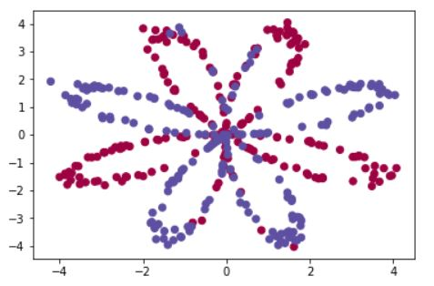

# Applying Logistic Regression using sklearn

Let __X__ be our input feature vector containing all training examples, and __Y__ be our corresponding output label. Assume we are building a 2-class classifier.
## Problem Statement
Given a set of _m_ points (i.e. __X__) and their color (i.e. __Y__) `0` for blue, `1` for red, we need to define regions in plane and the colors that they have in majority.
## Solution using sklearn
It's very easy to apply logistic regression on a dataset using sklearn. Here is the code for the same:
```python3
import sklearn
import sklearn.datasets
import sklearn.linear_model
import matplotlib.pyplot as plt

# Train the logistic regression classifier
clf = sklearn.linear_model.LogisticRegressionCV();
clf.fit(X.T, Y.T);

# Plot the decision boundary for logistic regression
plot_decision_boundary(lambda x: clf.predict(x), X, Y)
plt.title("Logistic Regression")

# Print accuracy
LR_predictions = clf.predict(X.T)
print ('Accuracy of logistic regression: %d ' % float((np.dot(Y,LR_predictions) + np.dot(1-Y,1-LR_predictions))/float(Y.size)*100) +
       '% ' + "(percentage of correctly labelled datapoints)")
```
## Comparision with Deep Neural Nets
It is obvious that deep neural nets perform better than logistic regression. Here is the result I obtained.
* Original Image
* * 

* Results obtained with logisitic regression 
* * 

* Results obtained with deep neural net 
* * 
   
